# Basic

---

## State：状态
1. 例如，在网格中，每个位置就是一个state，用$s_k$表示
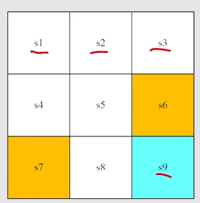
1. 状态空间：$S=\{s_k\}$
## action：动作
1. 例如，在每一个状态中，可以采取上下左右或者不动的action
   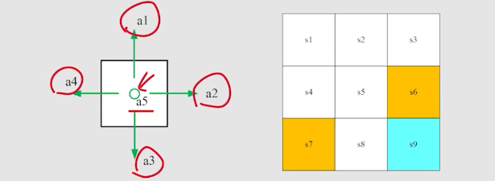
2. 动作空间Action space：$A(s_i)=\{a_i\}$
3. 动作空间是依赖于状态$s_i$的
## State transition：状态转移
1. 采取action时，可以从一个state转移到另一个state：
   1. $s_1\xrightarrow{a_2}s_2$
    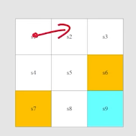
    这种状态转移是显式的写明的
   2. $s_1\xrightarrow{a_1}s_1$：撞墙了
2. **Forbidden area** : 
   1. 可以进去，但是会被惩罚$s_5\xrightarrow{a_2}s_6$
   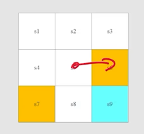
   2. 不可进去
3. 表格形式的状态转移：
    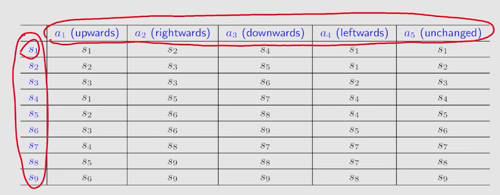
    1. 缺点：只能表示确定性的情况
    2. 解决方法：**State transition probalility**
    3. 数学描述: 
    $p(s_2|s1,a2)=1$
    $p(s_k|s1,a2)=0\  (k!=2)$
## Policy（策略）
1. 策略即一个条件概率，策略即在state下采取action的**条件概率** $\pi(a|s)$
2. 是一个概率，而不是函数，就是因为需要通过这种方式让策略变得“连续”，可以通过对不同概率分布求梯度来优化策略
3. 在s状态下采取各个策略的概率之和为1
4. 确定性的策略：在s状态下一定会采取某个action
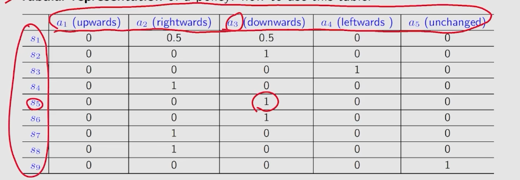
## Reward（奖励）
1. Reward是一个**标量**
2. Reward可以**类比深度学习的loss**,但是要求Reward要梯度上升
3. 但是loss是可导的，reward通常是不可导的，因此需要**策略梯度定理**，不直接对 Reward 求导（因为它不可导），而是对动作出现的概率求导，并用 Reward 来作为这个梯度的“权重”或“缩放因子”。
4. 在grid里，可以这样设计reward：$r_bound=-1,r_forbid=-1,r_target=1,其余情况r=0$
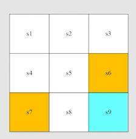
5. reward可以理解为一个人机交互的interface
6. 可以用**表格**来存储reward，reward是与state与action有关的
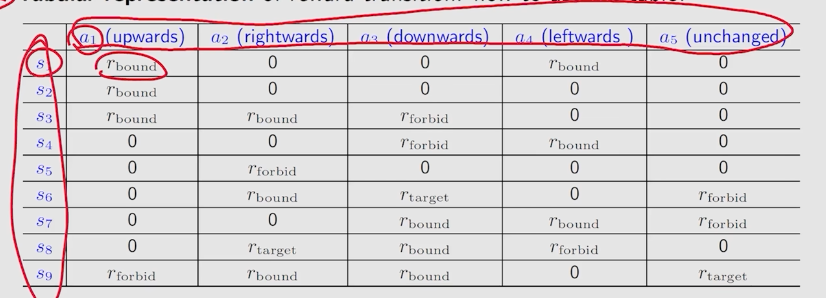
7. 用表格表示reward是**确定性的**
8. 要表示**不确定的**reward，需要用**条件概率**，例如$p(r=-1|s1,a1)=0.8……$
9. Reward表示成条件概率，不是因为reward需要学习，而是现实本身就是**具备随机性**的，例如拉老虎机
10. reward也可以设计为**需要学习的条件概率函数**，标准RL如 Q-Learning, PPO不需要学习，而高级/反向 RL例如逆强化学习、基于模型的强化学习、人类反馈强化学习 (RLHF)需要学习reward
## Trajectory与return
1. 一个trajectory是state-action-reward链（**SAR**）
2. **return**即**一个trajectory得到的reward的和**
   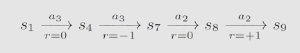
3. return的作用：用于评价trajectory
4. 在经典的策略梯度公式中，return的作用是**步长、权重**，类比优化器对学习率的调度。可以把 Return（回报）看作是一个**自带物理意义的、动态的样本权重**。环境通过 Return 来调整步长。环境觉得你做得好，就给你更大的步长去强化这个行为；觉得你做得烂，就让你往反方向走。
## Discounted return
1. 到达终点后采取不动action，return会+1+1+1一直到无穷，导致**发散**
2. 解决方法：引入**discount rate $\gamma$**
3. **Discounted return**: 一个trajectory的discounted return如下：$G_t=\Sigma^{\infin}_{k=0}\gamma^kR_{t+k+1}$，t代表当前时刻，t+k+1代表未来采取策略得到的reward,例如
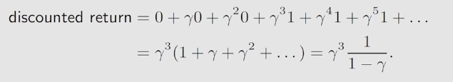
4. 如果discount rate=0,则agent极端近视，return依赖于最开始的reward
5. 如果discount rate=1，则agent极端远视，return注重于未来的reward
## Episode（回合）
1. terminal state：终点状态
2. 一个终点是terminal state的trajectory叫做**Epiode**
3. episode通常都是**有限步**的
4. 这样的任务称为**episodic tasks**
5. 但是有些任务**没有terminal states**，把这样的任务称为 **continuing tasks**
6. 实际应用会把episodic tasks处理为continuing tasks
7. 转换方法1：把target state认为是absorbing state，即无论采取什么action都会回到这个state，且reward都是0
8. 转换方法2：就认为是一个普通的state，可能会跳出来
## 马尔可夫决策（MDP/Markov devision process）：环境，交互与决策
1. MDP包括：
   - Sets：State集合S，Action集合A(s)，Reward集合R（s,a）（环境）
   - Probability distribution：$p(s'|s,a)$，$p(r|s,a)$（交互）
   - Policy：在s下采取a的**概率**为 $\pi(a|s)$(决策)
   - MDP的性质：与历史无关，$p(s_{t+1}|s_t,a_{t+1},...,a_1,s_0)=p(s_{t+1}|s_t,a_{t+1})$，$p(r_{t+1}|s_t,a_{t+1},...,a_1,s_0)=p(r_{t+1}|s_t,a_{t+1})$
2. 图来概括MDP
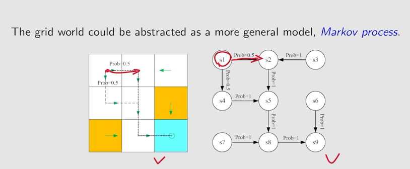
