# 贝尔曼公式Bellman Equation: 评判policy的方法
---
1. Return 是 一个trajectory的reward之和
2. return十分重要，环境一模一样，但是采取不同的策略：
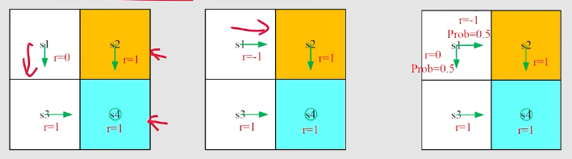
3. 为了将不同的策略进行对比，需要对不同策略产生的trajectory的return期望进行对比
4. 对于策略1，return为：$0+\gamma1+\gamma^21……=\frac{\gamma}{1-\gamma}$
5. 对于策略2,return为$-1+\gamma1+\gamma^21……=-1+\frac{\gamma}{1-\gamma}$
6. 对于策略3，return为$-0.5+\frac{\gamma}{1-\gamma}$
7. 策略3实际上即是代表S tate value
8. 另一种计算return的方法：用$v_i$表示$s_i$状态开始的return，**递归法**求解return：$v_i=r_i+\gamma v_{i+1}$
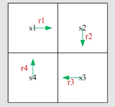
例如，$v_1=r_1+\gamma v_2$
这被成为**Bootstrapping**
9. 这种循环关系，看似不可能求解，但是实际上：
$\bold{v}=\bold{r}+\gamma\bold{Pv}$
在此例中$P=\begin{bmatrix}
    0,1,0,0\\
    0,0,1,0\\
    0,0,0,1\\
    1,0,0,0\\
\end{bmatrix}$
即$\bold{(I-\gamma P)v}=\bold{r}$，求解方程组就可以得到$\bold{v}$
$\bold{v}=\bold{r}+\gamma\bold{Pv}$即最简单的确定性的策略下的贝尔曼公式 

## State Value
考虑这样一个单步的过程：$S_t\xrightarrow{A_t}R_{t+1},S_{t+1}$
其中$S_t,A_t,R_{t+1}$都是random variables,也就是可以求exception
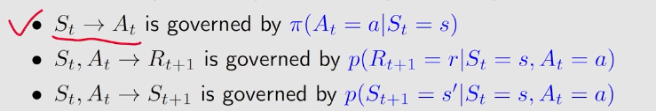
对一个trajectory求discounted return,记为$G_t$
1. 那么state value**就是$G_t$的expectation** 
2. 用$v_\pi(s)=E[G_t|S_t=s]$表示state value ,(一个条件期望,state取一个具体的值)
3. $v_\pi(s)$是一个s的函数
4. $v_\pi(s)$是一个$\pi$(策略)的函数
5. value大,则代表state更有价值

- return与state value的关系:return针对单个trajectory,state value是多个trajectory的期望

例子:三个不同策略下的state value
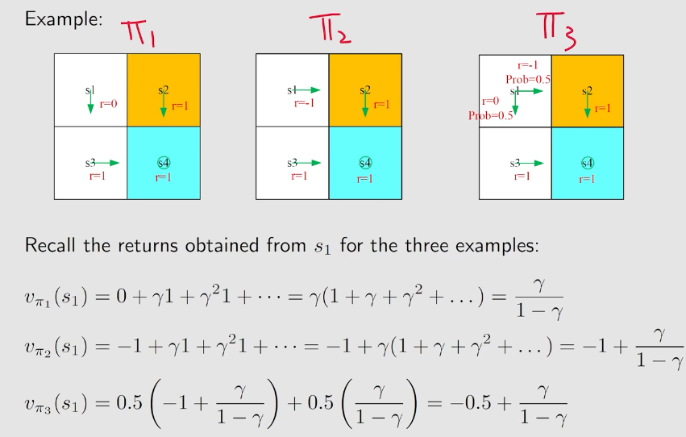

## Bellman Equation
1. **Bellman equation**描述的是**不同state的state value之间的关系**
2. 推导:$v_\pi(s)=E[G_t|S_t=s]\\=E[R_{t+1}+\gamma G_{t+1}|S_t=s]\\=E[R_{t+1}|S_t=s]+\gamma E[G_{t+1}|S_t=s]\\=\Sigma_a\pi(a|s)\Sigma_rp(r|s,a)r+\gamma \Sigma_{s'}v_\pi(s')\Sigma_ap(s'|s,a)\pi(a|s)\\=\Sigma_a\pi(a|s)[\Sigma_rp(r|s,a)r+\gamma\Sigma_{s'}v_\pi(s')p(s'|s,a)]$
3. 贝尔曼公式即:**当前state value=下一步可能的reward期望+下一步state的state value的期望**
4. 贝尔曼公式对状态空间的所有状态都成立,通过**解方程组**就可以解出state value
5. 贝尔曼公式依赖于**policy**($\pi(a|s)$),如果能计算出state value,就是在评价一个policy的好坏
6. 贝尔曼公式还依赖于环境因素,即**dynamic model**,$p(r|s,a),p(s'|s,a)$代表dynamic model
7. 即使不知道dynamic model,依然可以求出state value,即model free的算法

**例**:写出grid的贝尔曼公式
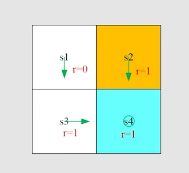
1. $v_\pi(s_1)=0+\gamma v_\pi(s_3)$
2. $v_\pi(s_2)=1+\gamma v_\pi(s_4)$
3. $v_\pi(s_3)=1+\gamma v_\pi(s_4)$
4. $v_\pi(s_4)=1+\gamma v_\pi(s_4)$

解方程组得到:
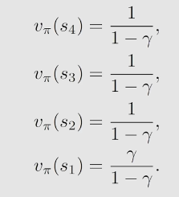

假设$\gamma=0.9$,得到
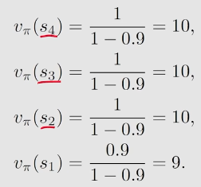
得到$v_\pi(s)$后就可以去改进策略,得到最优策略

**例二**:写出grid的贝尔曼公式
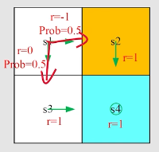

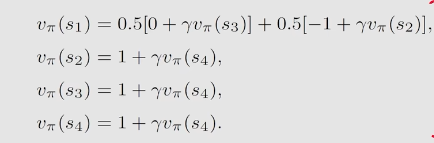

同样带入$\gamma=0.9$,得到
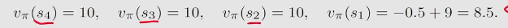
可以看出,$s_1$的state value下降了,因此这个策略是不如例一的策略的

## 贝尔曼公式的矩阵形式
1. 贝尔曼公式: $v_\pi(s)=r_\pi(s)+\gamma\Sigma_{s'}p_\pi(s'|s)v_\pi(s')$
2. 假设$s_i\in S$: $v_\pi(s_i)=r_\pi(s_i)+\gamma\Sigma_{s_j}p_\pi(s_j|s_i)v_\pi(s_j)$
3. 写作矩阵形式: $v_\pi=r_\pi+\gamma P_\pi v_\pi$
4. 其中$v_\pi=\begin{bmatrix}
    v_\pi(s_1)\\
    v_\pi(s_2)\\
    ...\\
    v_\pi(s_n)\\
\end{bmatrix}$
5. 其中$r_\pi=\begin{bmatrix}
    r_\pi(s_1)\\
    r_\pi(s_2)\\
    ...\\
    r_\pi(s_n)\\
\end{bmatrix}$
6. 其中$[P_\pi]_{ij}=p_\pi(s_j|s_i)$,这个矩阵被称为**state transition matrix**
n=4时: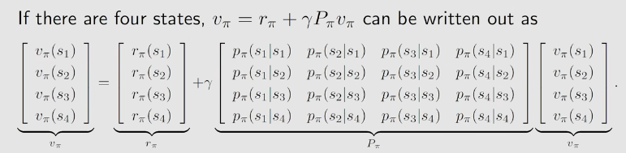
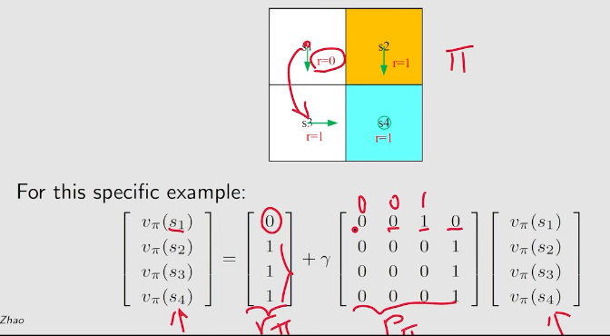
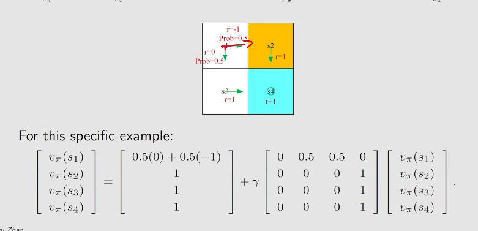

7. 使用贝尔曼公式的矩阵形式求解state value, 叫做**policy evaluation**, 从而评价一个policy的质量
8. 不求逆,使用迭代的方法:$v_k=r_\pi+\gamma P_\pi v_{k+1}$, 猜一个v_0,带入求v_1 ... $k\rightarrow\infin, v_k\rightarrow v_\pi$
9. 证明: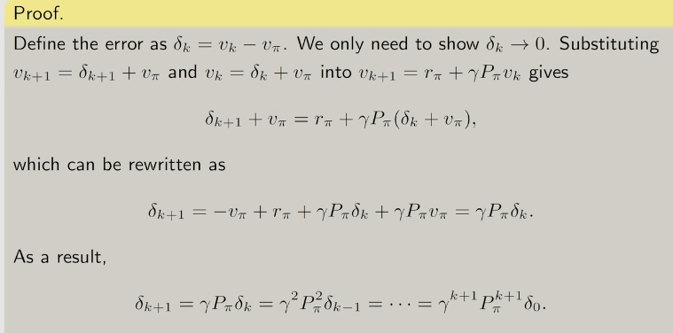 

## Action value
1. action value指的是,**从一个state出发,做出了一个action后的average return**
2. action value的定义:$q_\pi(s,a)=E[G_t|S_t=s,A_t=a]$
3. action value是依赖于s,a的函数
4. action依赖于不同的策略$\pi$
5. **action value与state value的联系**:$v_\pi(s)=\Sigma_a\pi(a|s)q_\pi(s,a)$
6. $q_\pi(s,a)=\Sigma_r p(r|s,a)+\Sigma_{s'}p(s'|s,a)v_\pi(s')$
7. 5说明知道action value,就能知道state value.6说明知道state value,就能知道action value
**例**:
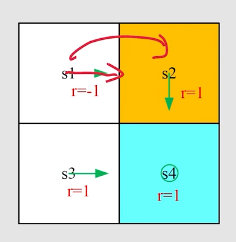
action value: $q_\pi(s_1,a_2)=-1+\gamma v_\pi(s_2)$

## 小结
1. **State Value**: 状态discounted return的期望
2. **Action Value**: 采取action后discounted return的期望
3. **Bellman equation**: 描述状态之间的state value的关系
4. 贝尔曼公式的**矩阵形式**,用于求解state value
5. **state value 与 action value的转化**
 

