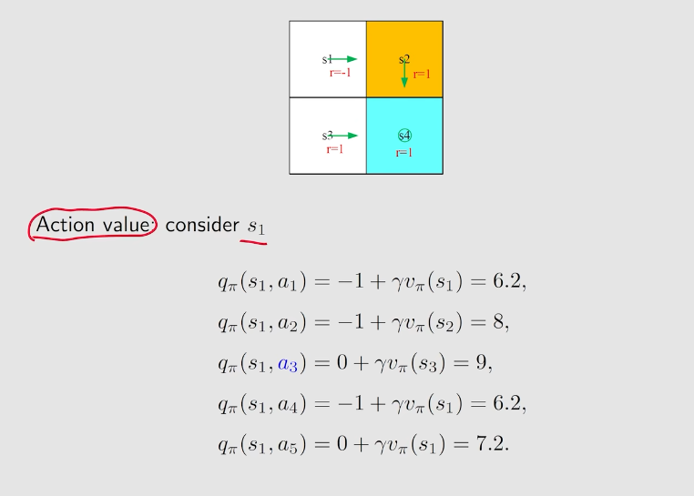
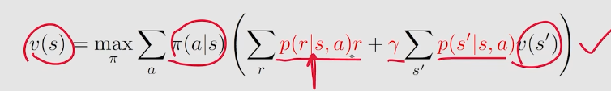
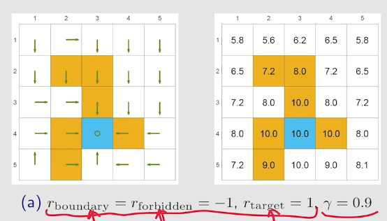
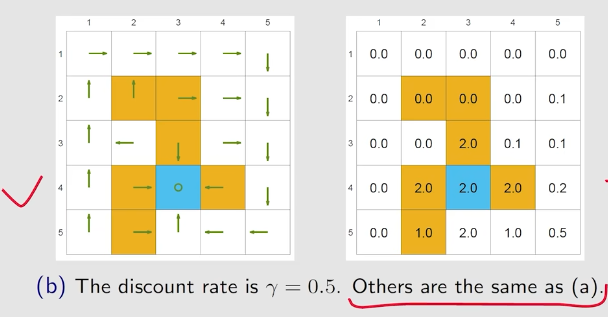
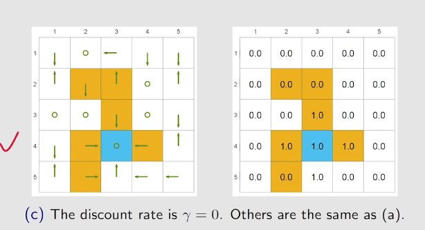
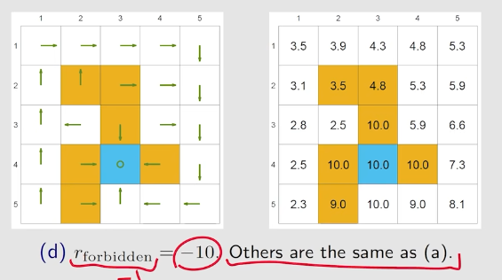
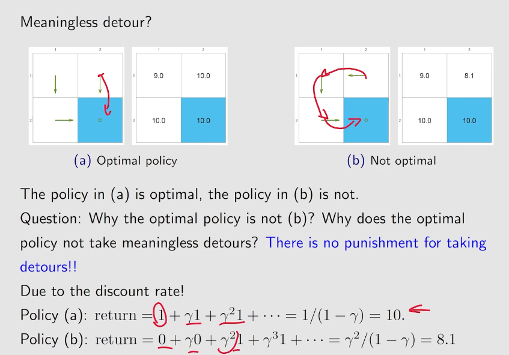

# 贝尔曼最优公式
---
1. $s_1$的action value:

2. 可以看出,当前策略可以改进,因为$q_\pi(s_1,a_3)>q_\pi(s_1,a_1)$
3. 改进方法:$$\pi_{new}(a|s_1)=
    \begin{cases}
        1&a=a^*\\
        0&a\neq a^*
    \end{cases}$$
其中$a^*$代表$q_\pi(s1,a_k)$中最大的$a_k$
4. 但如果$s_2,s_3$的策略不是最优,怎么办呢? 实际上,只要迭代这个方法,就一定能得到一个最优策略,即**贝尔曼最优公式**

## 贝尔曼最优公式
1. **最优策略**:如果对于所有的$s\in S$,都有:$$v_{\pi_1}(s)\geq v_{\pi_2}(s)$$
则称为$\pi_1优于\pi_2$如果一个策略优于所有策略,则称为最优策略
2. 最优策略的存在性
3. 最优策略的唯一性
4. 最优策略是否是确定性的
5. 怎么找到最优策略
6. **贝尔曼最优公式**$$v(s)=\max_\pi\sum_a\pi(a|s) q(s,a)$$
7. $q(s,a)$中，**环境是已知的**，也就是$p(r|s,a),p(s'|s,a)$是已知的
8. **最优的价值函数的待求的**，也就是$v(s)$和$q(s,a)$中的$v(s')$是待求的
9. 贝尔曼公式是给定$\pi(a|s)$的，但最优贝尔曼公式是要**求出一个最优的$\pi(a|s)$**
10. 最优贝尔曼公式的矩阵形式：$$
v=\max_\pi(r_\pi+\gamma P_\pi v)\\
其中\max_\pi(A)=\max_\pi\begin{bmatrix}
    a_1\\
    a_2\\
    ...\\
    a_n
\end{bmatrix}$$
11. 但是贝尔曼公式非常tricky而elegant，因为镶嵌了一个最优化问题

## 最优公式的最优策略问题
1. 我们既需要求解v，又需要求解$\pi$，看似一个公式无法求出两个未知量
2. 实际上，例如：这样的问题，$$x=\max_a(2x-1-a^2)$$可以先求出右边式子的最大值，看作关于a的函数，x是已知量，从而求出a
3. 回到贝尔曼最优公式，需要给$q(s|a)$一个初始值，然后求出最优的策略$\pi(a|s)$
4. 那么怎么求解最优的策略呢？实际上，$\pi$包含多个action，即是在**求解一套action的权重**使得$\pi(a|s)q(s,a)$最大
5. 假设有三个action，**即是在求$$
\max_{c_1,c_2,c_3}c_1q_1+c_2q_2+c_3q_3$$对应的$c_1^*,c_2^*,c_3^*$**
6. q确定，假设$q_3$最大（采取第三个action的action value最大），那么$c_1^*,c_2^*,c_3^*$就分别为0,0,1
7. 求解出$\pi$之后，等式右段即是一个关于$v$的函数，记作$f(v)$。方程变为$v=f(v)$

## 求解公式与最优性
1. 问题：求解$v=f(v)$
2. 不动点：如果$f(x)=x$，那么x就被称为**不动点**
3. Contraction mapping：$|f(x_1)-f(x_2)|\leq\gamma|x_1-x_2|$，其中$\gamma<1$。直观理解，就是$f(x_1),f(x_2)$映射后的距离变短了
4. **Contraction mapping theory（压缩映射定理，巴拿赫不动点）**: 如果f是一个Contraction mapping，则：
   - existence：一定存在一个不动点$x^*$，满足$f(x^*)=x^*$
   - uniqueness: 这样的不动点是唯一的
   - 求解：迭代式算法，$x_{k+1}=f(x_k)$，那么$x_k\rightarrow x^*$，且收敛速度是非常快的，是指数收敛的
5. **贝尔曼最优公式是一个Contraction mapping**
   - 因此一定存在解$v^*$
   - 这个解是唯一的
   - 这个解可以通过迭代法求出
6. 用$\pi^*$表达的贝尔曼最优公式：$$
v*=r_{\pi^*}+\gamma P_{\pi^*}v^*$$因此，**贝尔曼最优公式也是一个贝尔曼公式**，对应的策略是$\pi^*$
7. 可以证明$v^*$的state value是最大的
8. **$\pi^*$实际上就等于：$$
\pi^*(a|s)=\begin{cases}
    1&a=a^*(s)\\
    0&a\neq a^*(s)
\end{cases}$$所谓$a^*(s)$就是在s状态最大的action value**
9. 这个策略是deterministic 且 greedy的

## 分析最优策略
1. **什么因素决定了最优策略**？
    - 环境（系统模型） $p(r|s,a),p(s'|s,a)$
    - 设计的奖励r
    - 折扣因子$\gamma$

2. 改变不同因素，策略会如何改变？

   - 改变$\gamma$，$\gamma比较大的时候会比较远视$
   - 改变r
   - **但给每一个r都进行线性变换$r\rightarrow ar+b$，最优策略不变**
3. 有趣的问题：$\gamma$的另一个作用，防止做Meaningless detour。**为什么最优策略不选择多做几个reward是0的action呢？因为有$\gamma$的存在**

**因此，不需要设计成每走一步，就给一个负的reward**

## 总结：
- **贝尔曼最优公式**$$v(s)=\max_\pi\sum_a\pi(a|s) q(s,a)$$
- 矩阵形式$$v=\max_\pi(r_\pi+\gamma P_\pi v)\\其中\max_\pi(A)=\max_\pi\begin{bmatrix}
    a_1\\
    a_2\\
    ...\\
    a_n
\end{bmatrix}$$
- 贝尔曼最优公式一定存在唯一解（**不过策略不一定唯一**）
- 迭代式的算法
- 贝尔曼公式的解，state value和policy都是最优的

 