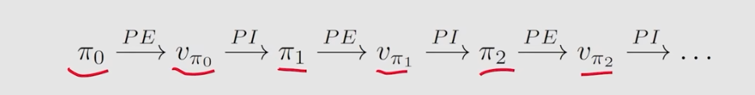
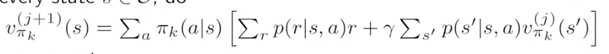
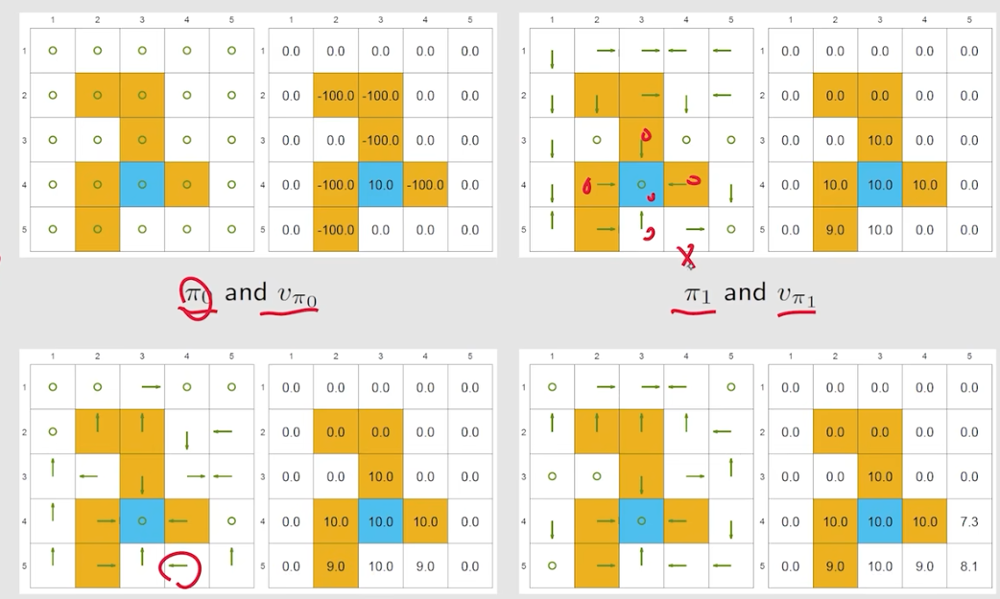
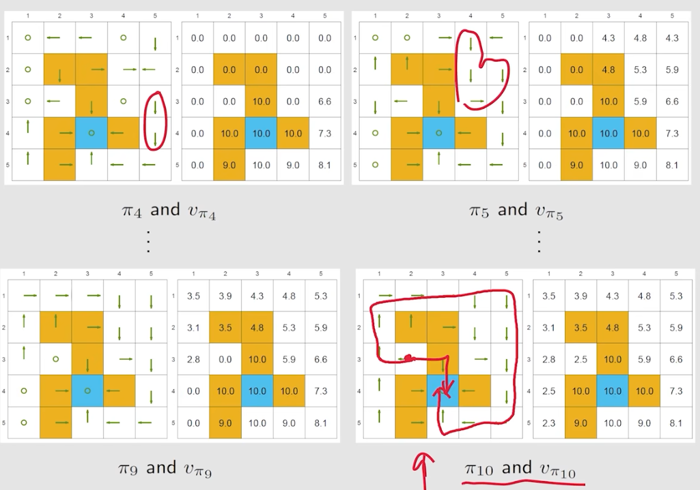
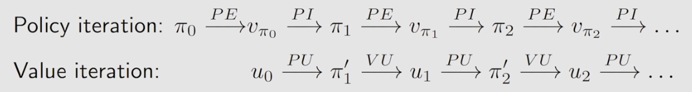
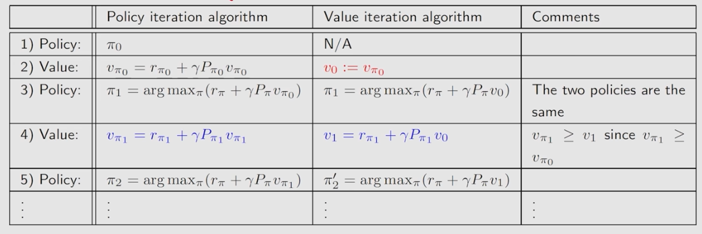
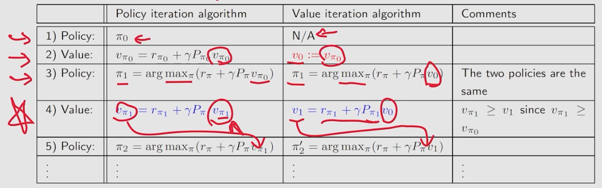
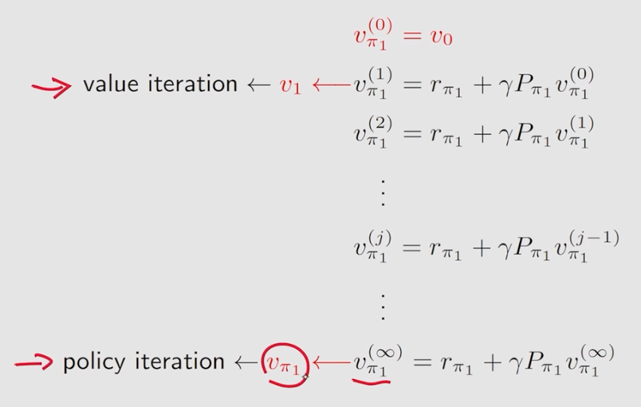
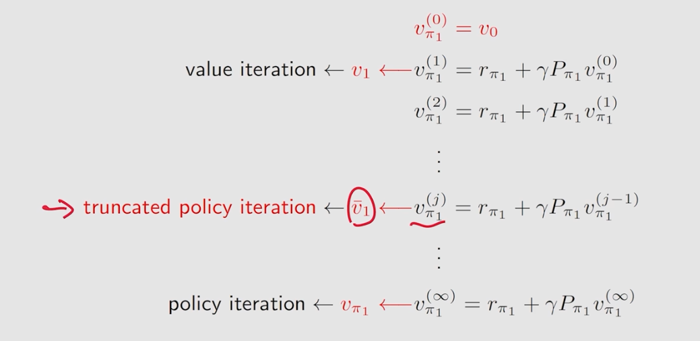
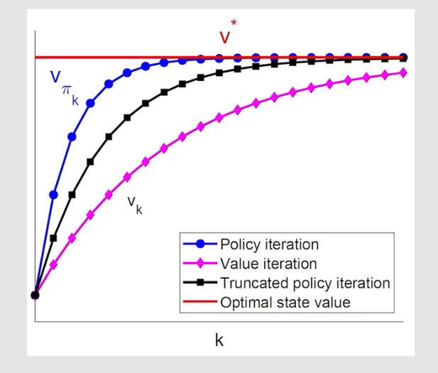

# 值迭代与策略迭代
---
## 值迭代
值迭代实际就是贝尔曼最优公式的求解过程
1. 值迭代的两个步骤：
   - **policy更新**：求出$v_k$对应最优的$\pi_{k+1}$
   - **value更新**：求出$v_{k+1}$,$v_{k+1}=r_{\pi_{k+1}}+\gamma P_{\pi_{k+1}}v_k$
2. Value iteration:
   1. Policy update: 已知$q_k(s,a)$，求最大的策略$\pi_{k+1}(s)$ 
   2. Value update: 求出$v_{k+1}(s)$
   3. 路径：$$v_k(s)\rightarrow q_k(s,a)\rightarrow greedy\ policy\ \pi_{k+1}(a|s)\rightarrow new\ value\ v_{k+1}=\max_aq_k(s,a)$$
   4. **伪代码**：如果$v_k$还没有收敛($|v_{k+1}-v_k|<\epsilon$)
      - 遍历所有的s：对于每个s
      - 遍历所有的a，找到最大的q(s,a)
      - 更新策略，使用最大的q(s,a)
      - 更新状态价值函数，$v_{k+1}$

## 策略迭代
1. 策略迭代的步骤：给定初始的策略$\pi_0$
   - **policy evaluation**（PE）：求解**state value**
   - **policy improvment**（PI）：优化策略，求解优化问题，得到$\pi_{k+1}$ $$\pi_{k+1}=\arg\max_\pi(r_\pi+\gamma P_\pi v_\pi)$$
2. 路径：
3. 怎么求解state value？**矩阵法或迭代法求这个策略的state value**
4. $\pi_{k+1}$一定更好：证明看书
5. 策略迭代可以找到最优的策略：证明看书
6. 值迭代和策略迭代是截断策略迭代的两个极端
7. 伪代码：
   -  迭代：
   - 策略评价（PE）：
     - 猜测一个初始state value $v_{\pi_k^{(0)}}$
     - 迭代state value，**无穷次迭代**：对于每一个s,带入迭代式
   - 策略优化（PI）：
     - 对于每个s的每个a：求出$q_{\pi_k}(s,a)$
     - 更新策略，$q_{\pi_k}(s,a)$最大的action

**越近的状态策略会变好的越快**

## 截断策略迭代
1. 与策略迭代与值迭代的对比：

前三步都是一致的，在第四步出现了分歧

- 策略迭代（policy iteration）需要完整求解贝尔曼公式，**迭代出真实的state value**
- 值迭代**只迭代一次**

- 截断策略迭代，迭代k次就停止

2. 伪代码：
   -  迭代：
   - 策略评价（PE）：
     - 猜测一个初始state value $v_{\pi_k^{(0)}}$
     - **只迭代k次**：对于每一个s,带入迭代式
   - 策略优化（PI）：
     - 对于每个s的每个a：求出$q_{\pi_k}(s,a)$
     - 更新策略，$q_{\pi_k}(s,a)$最大的action
3. 只迭代k次，依然收敛
4. **迭代曲线对比**

## 总结
1. 值迭代：与上节课的压缩映射定理相同
2. **策略迭代**：分为两步，**Policy evaluation**(迭代计算state value)、**Policy improvement**(策略优化)
3. **截断策略迭代**：是值迭代与策略迭代的一般情况

 