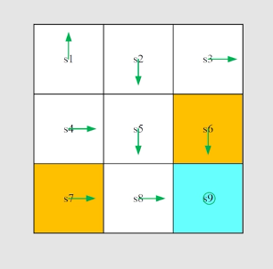
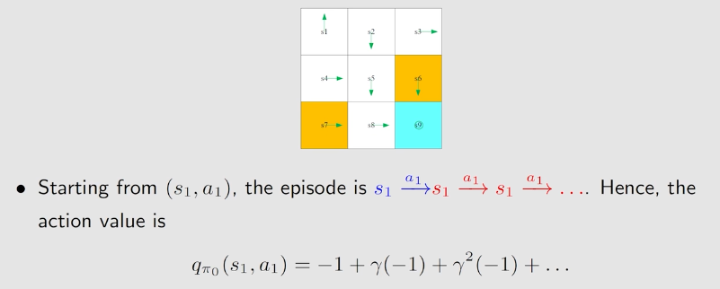
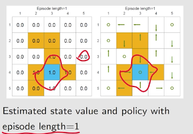
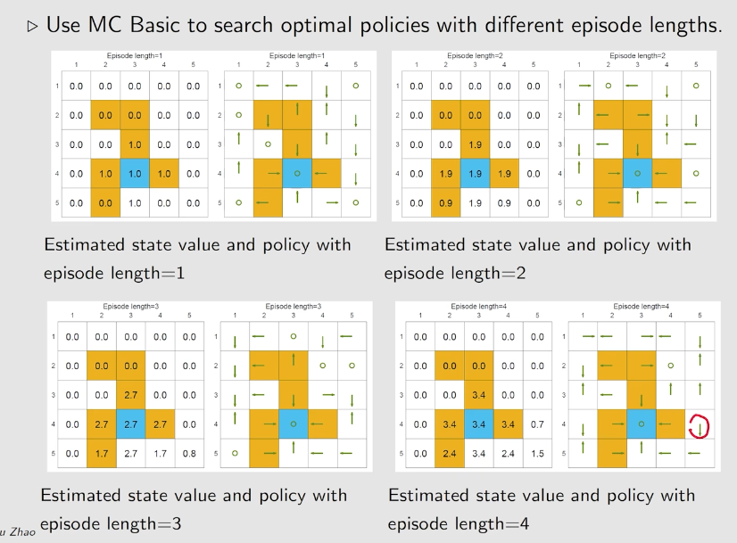
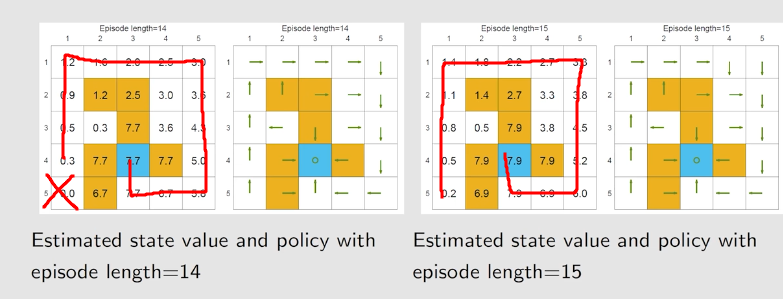
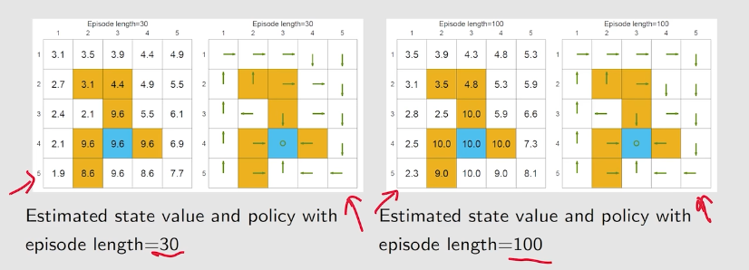

# 蒙特卡洛方法
---
1. 蒙特卡洛方法基于policy iteration，将模型(环境)的部分替换掉
2. 蒙特卡洛的例子：用统计量估计概率
3. 例如：用抛硬币的样本来估计硬币正面朝上的概率
4. 蒙特卡洛采样是**无偏的**（$E[\bar x]=E[X],Var[\bar x]=\frac{1}{N}Var[X]$,因此$N\rightarrow\infin,\bar x\rightarrow E[X]$）

## MC-Basic
1. 原始的Policy Iteration：
   - 求state value：$$
v_{\pi_k}^{(j+1)}=\sum_a\pi(a|s)q_{\pi_k}(s,a)
$$
   - 求更优的策略：$$\pi_{k+1}=\arg\max_\pi\sum_a\pi(a|s)q_{\pi_k}(s,a)$$
   - **关键在于求$q_{\pi_k}(s,a)$**
2. 求$q_{\pi_k}(s,a)$有两种方法：
   - 依赖于模型的：$$
q_{\pi_k}(s,a)=\sum_rp(r|s,a)r+\sum_{s'}p(s'|s,a)v_{\pi_k}(s')$$
    - **依赖于原始定义**：$$
q_{\pi_k}(s,a)=E[G_t|s,a](G_t为discounted\ return)$$
    - model free方法的思想就是依赖于原始定义
1. 求解方法
   1. **从原始(s,a)出发，根据策略$\pi_k$，跑一条episode**
   2. **产生一个return**$g(s,a)$
   3. **$g(s,a)$是$G_t$的采样**
   4. 只要有足够多的采样，就能**估计**$E[G_t|s,a]$
2. 因此，如果没有模型，就要有数据 
3. 伪代码：进行k轮迭代:对于每一个状态s：
   1. **对于状态s的每一个a，采样多条episode，估计$q_{\pi_k}(s,a)$**，得到s的state value
   2. 改进策略，选择$q_{\pi_k}(s,a)$的$a$作为$a^*$
4. 因此：
   - MC-basic是Policy iteration的变形
   - 实践中效率太低，并不实用
   - MC-Basic直接估计action value，而不是Policy Iteration中估计state value
   - MC-Basic是收敛的

## MC-Basic的例子
1. 初始的策略$\pi_0$，采用MC-basic算法

   - 每个state有五个action,有9个state,**共45个$q_{\pi_k}(s,a)$**
   - 从每个action value出发进行采样n次，共需要45*n次采样 
1. 步骤：
   - **policy evaluation**，需要采样$q_{\pi_k}(s_1,a_1)$，由于**策略是deterministic的，而且环境也是deterministic的**，因此采样一次就能得到准确的$q_{\pi_k}(s_1,a_1)$ 
   - 从$(s_1,a_1)$进行采样，得到$q_{\pi_0}(s_1,a_1)=-1+\gamma(-1)+...$
   - 同理，采样出所有的$q_{\pi_0}(s_1,a_n)$
   - **policy improvment**:改进策略，选择最大的$q_{\pi_0}(s_1,a_n)$，因此选择$q_{\pi_0 }(s_1,a_2)$
3. 关于episode的长度：
   -  如果episode length=1，只有与终点紧挨着的state的optimality policy是正确的，其他的全是0
   - 继续增加，越来越多的策略变得正确
   - 增加到14，路径为14的正确，路径为15的依然在随机选择
   - 增加到15,所有的都正确了
   - 继续增加，策略已经不变了，只是state value在增大
   - 由此可知：**episode length必须足够长，让所有的episode都有机会到达目标，但也无需无限长**

 